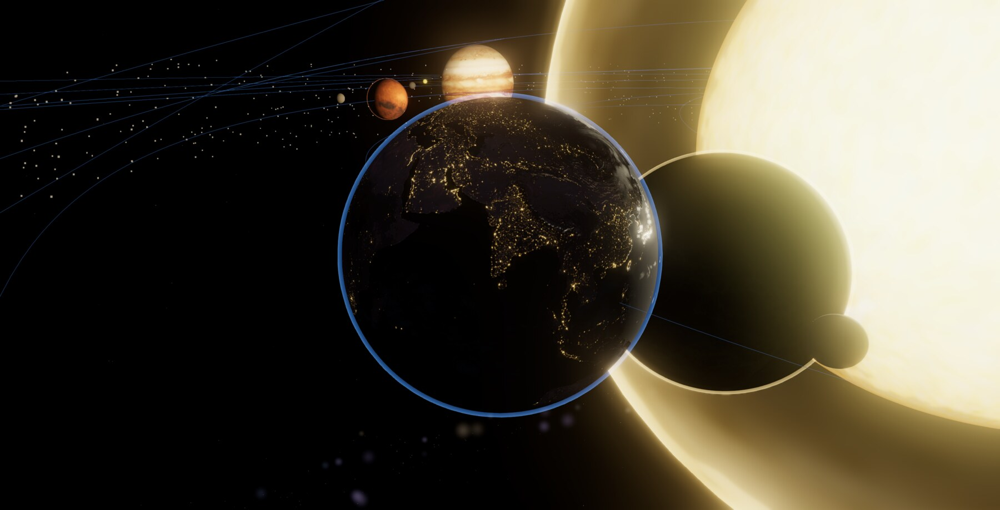
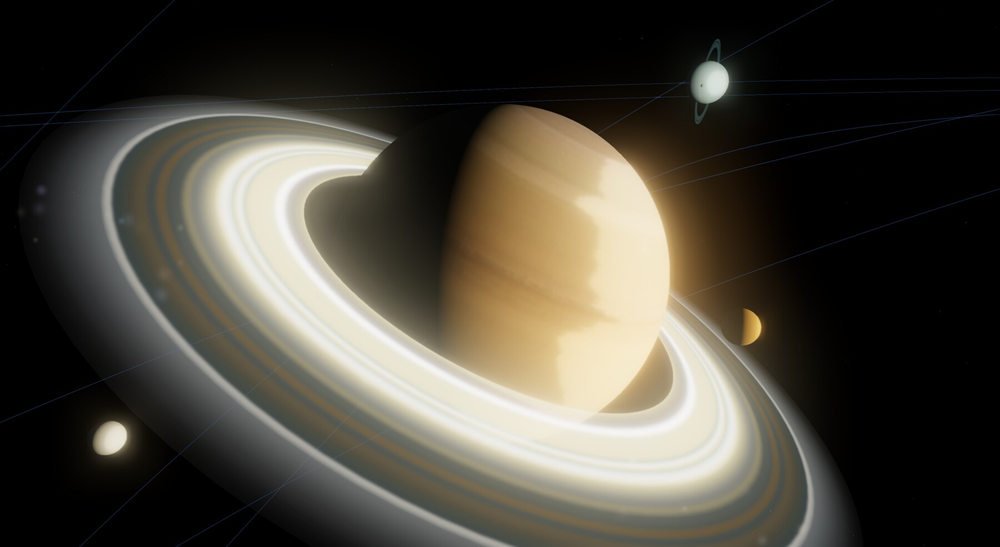
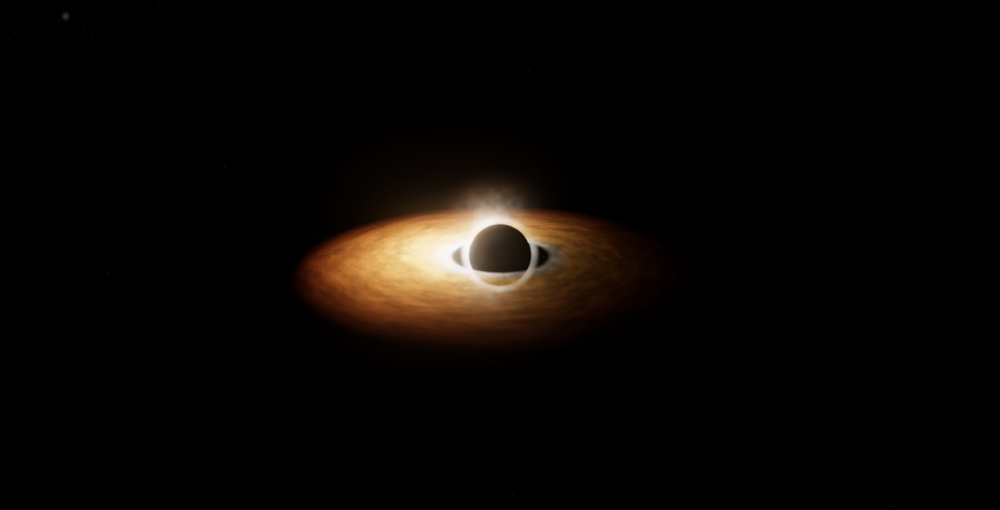
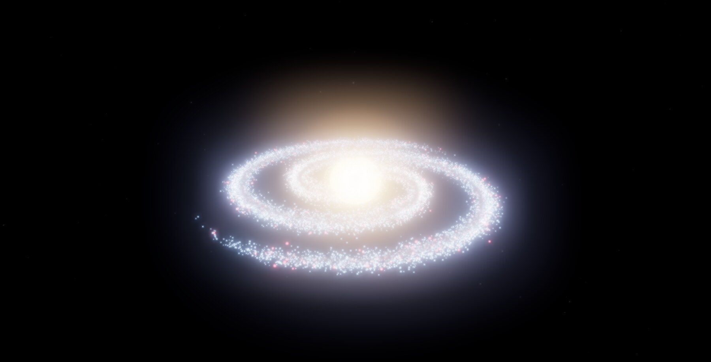

<div align="center">

# 🌌 Universe Experience Platform

**An observation-first, provenance-aware, scale-adaptive scientific atlas of the universe — from your back garden to the cosmic microwave background.**

[](.github/workflows/ci.yml)
[](tests/)
[](LICENSE)
[](backend/requirements.txt)
[](https://threejs.org)

*Fly from Earth's city lights, past Saturn's rings and the real Gaia starfield, through nebulae and galaxies, out to the cosmic web and the first light of the Big Bang — with every object honestly labelled as measured, derived, simulated, or illustrative.*



|  |  |  |
|:--:|:--:|:--:|
| *Saturn, in-app photo mode* | *Sgr A\* — lensed accretion disk* | *Andromeda (procedural model)* |

</div>

> **The scientific contract:** everything visible is either **measured** from an
> authoritative catalogue, **derived** from measurements, **simulated** from public
> models, or **procedurally** generated as a *declared* prior — and the UI always
> tells you which.

---

## ✨ Features

**9 layers** — 8 observational, 1 explicitly theoretical — spanning ~26 orders of magnitude:

| | Layer | Real data |
|---|---|---|
| ☉ | **Solar System** — 8 planets (real NASA textures, rings, atmospheres, 13 moons), 5 dwarf planets, asteroid belt, animated real-time orbits | JPL Keplerian elements |
| 🪐 | **Exoplanets** — 16 real systems (TRAPPIST-1 …) with habitable zones | NASA Exoplanet Archive |
| ✦ | **Stellar neighbourhood** — 6,000 real stars, colour-coded by measurement confidence, with diffraction-spike rendering | ESA Gaia DR3 |
| 🌫 | **Nebulae** — Orion, Eagle, Carina, Helix, Crab as volumetric gas clouds | literature + procedural |
| 🌀 | **Resolved galaxies** — 7 famous galaxies (spiral/barred/elliptical/edge-on), a 3-D "field" view, and each one's marked **central black hole** | literature + procedural |
| 🌌 | **Cosmic web** — 9,000 galaxies at their comoving distances, redshift-coloured | 2MASS Redshift Survey |
| 🔥 | **Cosmic microwave background** — the all-sky surface of last scattering | Planck / WMAP / COBE |
| ⚫ | **Black holes** — Sgr A* & M87*: turbulent Doppler-beamed disk, lensed far-side arcs, golden photon ring, orbiting hot spot & jet | Event Horizon Telescope |
| 🕳 | **Wormhole** — a traversable Einstein–Rosen bridge with a lensed starfield throat, clearly labelled **THEORETICAL** | Einstein–Rosen 1935 · Morris–Thorne 1988 |

**All four UX modes from the design guide:**

- 🛰 **Free exploration** — orbit, zoom and fly across every scale; a side **scalar** shows the physical size of your view (AU / pc / ly / Mpc / Schwarzschild radii).
- 🎬 **Guided tour** — a narrated 11-stop cinematic journey from Earth to the Big Bang.
- 📊 **Data inspection** — real charts: a **Hertzsprung–Russell diagram** of the Gaia stars, **transit light curves** for exoplanets, and a **redshift histogram** of the cosmic web.
- ♿ **Accessible & educational** — full keyboard control, a **reduced-motion** mode (honours `prefers-reduced-motion`), focus styles, captions, and a shortcuts panel.

**A cinematic, "Deep Field" experience:**

- 🎞 **Cinematic intro** — THE UNIVERSE title screen with an establishing camera dolly into the Solar System.
- 🔊 **Generative ambient soundscape** — a WebAudio space drone (no audio files) with whooshes on every camera flight; mutable, persisted.
- 🌫 **Parallax space dust** — camera-wrapped particles that make every movement feel dimensional.
- 🎬 **Documentary lower-thirds** — cinematic object titles on selection; glassmorphism panels, aurora accents, instrument-style mono numerals.
- 📚 **Deep-knowledge cards** — ~45 curated entries: a story, a *did-you-know* and a *sense-of-scale* comparison for every notable object.
- 📷 **Photo mode** — `P` hides the interface, `S` saves a 4K PNG.
- ☀ **Light & dark themes** · living Sun (boiling corona, rim flares, limb darkening) · low-orbit **surface view** with landmark markers and orbital cruise.

**Provenance & rights everywhere** — every object carries a `source_type` / `confidence` / `credit` payload; an in-app **Credits** ledger lists every required acknowledgement.

> 📸 All screenshots were captured with the app's own **photo mode** (`P`, then `S`).

---

## 🚀 Quick start

```bash
git clone https://github.com/demetacrypto/universe-experience-platform.git
cd universe-experience-platform

python3 -m venv .venv && source .venv/bin/activate
pip install -r backend/requirements.txt

python backend/pipeline.py            # pulls live Gaia/2MRS/exoplanet data (sample fallback offline)
python -m pytest -m "not network"     # 43 tests
python -m uvicorn backend.api.server:app --port 8000
# open http://localhost:8000
```

Or with Docker:

```bash
docker compose up --build             # → http://localhost:8000
```

**Keyboard:** `1`–`9` switch layers · `← →` cycle · `T` tour · `D` data · `P` photo mode · `S` save shot · `R` reduced motion · `Esc` close.

---

## 🏗 Architecture

```
   ARCHIVES                  SCIENCE PIPELINE (Python)         DELIVERY            CLIENT (browser)
 Gaia · SIMBAD · NED   ─▶  ingest → provenance → coords   ─▶  JSON / tiles   ─▶  Three.js + WebGL
 Exoplanet Archive         (Astropy, HEALPix, Planck18)        Parquet/Zarr        bloom · SMAA
 2MRS · EHT · JPL          curate → deliver                    FastAPI API         8 layers · charts
```

- **Backend** — Python: Astropy / Astroquery ingestion, a provenance truth model, HEALPix
  sky partitioning, a three-zone data lake (raw → curated → delivery), a **FastAPI** service
  (search, resolve, tiles) with **rate-limiting + security headers + object-level rights**,
  and a **federated multi-archive resolver** (SIMBAD/NED/VizieR/MAST).
- **Frontend** — Three.js (WebGL today, WebGPU-detected) with bloom, SMAA, procedural and
  real NASA textures, and a single scientific scene-graph behind every layer.

See **[`docs/IMPLEMENTATION_PLAN.md`](docs/IMPLEMENTATION_PLAN.md)** for the full roadmap,
team/cost model, and feature gap analysis.

## 📁 Project structure

```
backend/
  uep/            provenance, coords, healpix, ingest, the 8 layer builders,
                  archives/ (adapter framework), security.py
  api/server.py   FastAPI: /api/manifest /api/resolve /api/object /api/tile …
  pipeline.py     raw → curated → delivery orchestrator
web/              app.js + one module per layer/scene + knowledge.js (curated
                  facts) + sound.js (generative audio) + datainspect/starinfo
tests/            43 pytest checks incl. golden scenes
docs/             implementation plan
Dockerfile · docker-compose.yml · .github/workflows/ci.yml
```

## 🧰 Tech stack

Python · Astropy · Astroquery · NumPy/Pandas · healpy · FastAPI · pytest ·
Three.js (r160) · WebGL/WebGPU · Docker · GitHub Actions.

---

## 🙏 Acknowledgements (required attributions)

This project would not exist without these open archives and missions:

- **ESA/Gaia/DPAC** — Gaia DR3 (CC BY-SA 3.0 IGO).
- **NASA/JPL Solar System Dynamics** — orbital elements & body data.
- **NASA Exoplanet Archive** (NExScI/Caltech).
- **2MASS Redshift Survey** (Huchra et al. 2012), via **VizieR/CDS, Strasbourg**.
- **SIMBAD** (CDS) and the **NASA/IPAC Extragalactic Database (NED)**.
- **Event Horizon Telescope Collaboration** (2019, 2022).
- **Planck / WMAP / COBE** missions; cosmology via **Planck18** (Astropy).
- Planet/Moon textures derived from NASA imagery, via threejs.org and the
  `threex.planets` project.

The in-app **Credits** panel reproduces these acknowledgements.

## 🤝 Contributing

Contributions welcome — see **[CONTRIBUTING.md](CONTRIBUTING.md)**. The one rule:
keep it scientifically honest and attach provenance to any data you add.

## 📜 License

Code is released under the **[MIT License](LICENSE)**. Astronomical data and imagery
remain subject to their providers' terms (see Acknowledgements).

<div align="center">
<sub>Built to let anyone experience the universe — accurately. ✦</sub>
</div>
