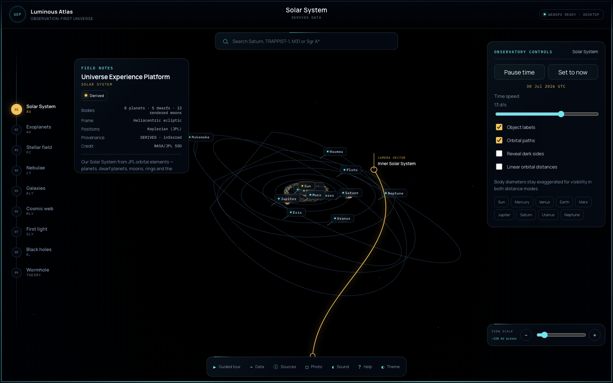

<div align="center">

# 🌌 Universe Experience Platform

**An observation-first, provenance-aware, scale-adaptive scientific atlas of the universe — from your back garden to the cosmic microwave background.**

[](.github/workflows/ci.yml)
[](tests/)
[](LICENSE)
[](backend/requirements.txt)
[](https://threejs.org)

*Fly from Earth's city lights, past Saturn's rings and an evidence-labelled stellar field, through nebulae and galaxies, out to the cosmic web and the first light of the Big Bang. Live archive measurements and deterministic fallbacks are never presented as the same thing.*



|  |  |  |
|:--:|:--:|:--:|
| *Saturn, in-app photo mode* | *Sgr A\* — lensed accretion disk* | *Andromeda (procedural model)* |

</div>

> **The scientific contract:** each layer declares whether its inputs are
> **observed**, **derived/modelled**, or **procedural/illustrative**. Mixed layers
> separate catalogue values from display geometry, and approximate literature
> compilations are labelled as estimates rather than survey-grade measurements.

---

## ✨ Features

**9 evidence-aware layers** spanning horizon scales, AU, parsecs, light-years,
megaparsecs and the surface of last scattering:

| | Layer | Real data |
|---|---|---|
| ☉ | **Solar System** — 8 planets, 5 dwarf planets, 13 selected rendered moons, rings, atmospheres, asteroid belt and animated approximate orbits; volatile total moon counts include an as-of date | JPL approximate Keplerian elements + NASA body facts |
| 🪐 | **Exoplanets** — live ingestion queries a 17-host showcase allowlist; strict-offline builds contain a clearly scoped 2-system snapshot with all seven TRAPPIST-1 planets and Proxima b. Equilibrium temperatures and habitable zones are model-derived | NASA Exoplanet Archive / declared bundled snapshot |
| ✦ | **Stellar neighbourhood** — up to 6,000 Gaia DR3 stars when the live archive is used; deterministic offline builds use an unmistakably labelled illustrative sample | ESA Gaia DR3 / declared procedural fallback |
| 🌫 | **Nebulae** — Orion, Eagle, Carina, Helix and Crab with approximate literature dimensions and explicitly procedural gas volumes | literature estimates + procedural render |
| 🌀 | **Resolved galaxies** — 7 famous galaxies and a 3-D field view; detected central black holes may be marked, while M33's non-detection/upper limit is shown without a black-hole marker | heterogeneous literature estimates + procedural render |
| 🌌 | **Cosmic web** — 9,000 redshift-coloured galaxies from 2MRS when live ingestion is enabled; strict-offline builds use a declared procedural filament prior | 2MASS Redshift Survey / declared procedural fallback |
| 🔥 | **Cosmic microwave background** — observed mean temperature/anisotropy, model-derived redshift/age/distance and a procedural all-sky pattern that is not the Planck map | Planck / WMAP / COBE + standard cosmology |
| ⚫ | **Black holes** — Sgr A* & M87* with measured mass/distance/ring inputs calibrating a normalized, EHT-anchored schematic; not a GR ray-traced prediction or EHT reconstruction | Event Horizon Telescope literature |
| 🕳 | **Wormhole** — a Morris–Thorne traversable-wormhole model, explicitly distinguished from the non-traversable Einstein–Rosen bridge and labelled **THEORETICAL** | Morris–Thorne 1988 / Einstein–Rosen 1935 distinction |

**All four UX modes from the design guide:**

- 🛰 **Free exploration** — orbit, zoom and fly across every scale; a side **scalar** shows the physical size of your view (AU / pc / ly / Mpc / Schwarzschild radii).
- 🎬 **Guided tour** — a captioned 11-stop cinematic journey from Earth to the CMB.
- 📊 **Data inspection** — an evidence-aware **Hertzsprung–Russell diagram**, modelled **transit light curves**, and a **redshift histogram** whose source mode follows the active payload.
- ♿ **Accessible & educational** — full keyboard control, a **reduced-motion** mode (honours `prefers-reduced-motion`), focus styles, captions, and a shortcuts panel.

**A cinematic “Luminous Atlas” experience:**

- 🎞 **Cinematic intro** — THE UNIVERSE title screen with an establishing camera dolly into the Solar System.
- 🔊 **Generative ambient soundscape** — a WebAudio space drone (no audio files) with camera-flight accents and a persisted mute preference.
- 🌫 **Parallax space dust** — camera-wrapped particles that make every movement feel dimensional.
- 🎬 **Evidence-aware flight deck** — scale stations, camera-vector routes, anchored instrument labels, restrained telemetry and progressive detail.
- 📚 **Deep-knowledge cards** — ~45 curated entries: a story, a *did-you-know* and a *sense-of-scale* comparison for every notable object.
- 📷 **Photo mode** — `P` hides the interface and `S` saves the current WebGL viewport as a PNG.
- ☀ **Light & dark themes** · living Sun (boiling corona, rim flares, limb darkening) · low-orbit **surface view** with landmark markers and orbital cruise.

**Provenance at the decision boundary** — every public delivery is tied to an
upstream `dataset_release` and a separate local `delivery_release`. Stellar rows
are rights-filtered before static delivery, layer payloads declare their public
source terms, and the in-app **Sources** ledger records acknowledgements. Some
hand-curated literature estimates still have only layer/object-level citations;
the UI calls those estimates explicitly.

> 📸 The object triptych was captured with the app's **photo mode** (`P`, then
> `S`). The Luminous Atlas hero is a browser-QA capture with the interface visible.

---

## 🚀 Quick start

```bash
git clone https://github.com/demetacrypto/universe-experience-platform.git
cd universe-experience-platform

python3 -m venv .venv && source .venv/bin/activate
pip install -r backend/requirements.txt

python backend/pipeline.py            # pulls live Gaia/2MRS/exoplanet data (sample fallback offline)
python -m pytest -m "not network"     # backend + API quality suite
python -m uvicorn backend.api.server:app --port 8000
# open http://localhost:8000
```

For a deterministic build that performs no archive calls, use
`python backend/pipeline.py --no-live`. Frontend quality gates are available via
`npm ci && npm run check`; browser journeys use `npm run test:e2e`.

Container startup accepts `UEP_INGEST=sample` (the immutable baked offline
release), `prefer-live` (live archives with labelled fallback), or `live`
(strict: all three live sources must succeed or the container stops).

Or with Docker:

```bash
docker compose up --build             # → http://localhost:8000
```

**Keyboard:** `1`–`9` switch layers · `← →` cycle · `T` tour · `D` data · `P` photo mode · `S` save shot · `R` reduced motion · `Esc` close.

---

## 🏗 Architecture

```
   ARCHIVES                  SCIENCE PIPELINE (Python)         DELIVERY            CLIENT (browser)
 Gaia · SIMBAD · NED   ─▶  ingest → provenance → coords   ─▶  JSON / tiles   ─▶  Three.js + WebGL
 Exoplanet Archive         (Astropy, HEALPix, Planck18)        curated Parquet     bloom + adaptive quality
 2MRS · EHT · JPL          rights filter → deliver             FastAPI API         9 layers + charts
```

- **Backend** — Python: Astropy / Astroquery ingestion, a provenance truth model, HEALPix
  sky partitioning, a three-zone data lake (raw → curated → delivery), a **FastAPI** service
  (search, resolve, tiles) with **rate-limiting + security headers + object-level rights**,
  and a **federated multi-archive resolver** (SIMBAD/NED/VizieR/MAST).
- **Frontend** — Three.js/WebGL with adaptive pixel ratio, bloom, procedural and
  NASA-derived textures, one scene graph per layer, reduced motion, and a
  responsive observatory shell.

See **[`docs/IMPLEMENTATION_PLAN.md`](docs/IMPLEMENTATION_PLAN.md)** for the full roadmap,
team/cost model, and feature gap analysis.

## 📁 Project structure

```
backend/
  uep/            provenance, coords, healpix, ingest, the 9 layer builders,
                  archives/ (adapter framework), security.py
  api/server.py   FastAPI: /api/manifest /api/resolve /api/object /api/tile …
  pipeline.py     raw → curated → delivery orchestrator
web/              app.js + one module per layer/scene + knowledge.js (curated
                  facts) + sound.js (generative audio) + datainspect/starinfo
tests/            pytest, Node unit/coverage and Playwright browser journeys
docs/             implementation plan
Dockerfile · docker-compose.yml · .github/workflows/ci.yml
```

## 🧰 Tech stack

Python · Astropy · Astroquery · NumPy/Pandas · healpy · FastAPI · pytest ·
Three.js (r160) · WebGL/WebGPU · Docker · GitHub Actions.

---

## 🙏 Acknowledgements (required attributions)

This project would not exist without these open archives and missions:

- **ESA/Gaia/DPAC** — Gaia DR3 (CC BY-SA 3.0 IGO).
- **NASA/JPL Solar System Dynamics** — orbital elements & body data.
- **NASA Exoplanet Archive** (NExScI/Caltech).
- **2MASS Redshift Survey** (Huchra et al. 2012), via **VizieR/CDS, Strasbourg**.
- **SIMBAD** (CDS) and the **NASA/IPAC Extragalactic Database (NED)**.
- **Event Horizon Telescope Collaboration** (2019, 2022).
- **Planck / WMAP / COBE** missions; cosmology via **Planck18** (Astropy).
- Planet/Moon textures derived from NASA imagery, via threejs.org and the
  `threex.planets` project.

The in-app **Credits** panel reproduces these acknowledgements.

## 🤝 Contributing

Contributions welcome — see **[CONTRIBUTING.md](CONTRIBUTING.md)**. The one rule:
keep it scientifically honest and attach provenance to any data you add.

## 📜 License

Code is released under the **[MIT License](LICENSE)**. Astronomical data and imagery
remain subject to their providers' terms (see Acknowledgements).

<div align="center">
<sub>Built to let anyone experience the universe — accurately. ✦</sub>
</div>
